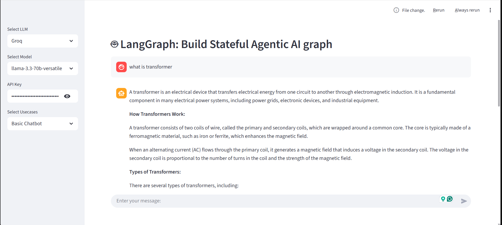
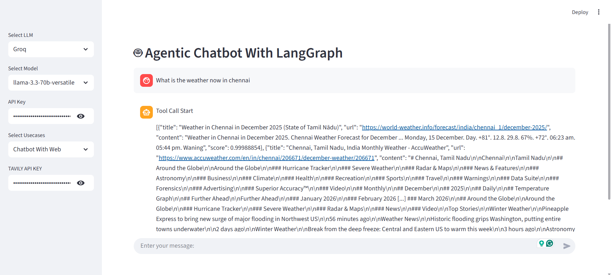

# Agentic AI Chatbots with Web Search




## Overview

This project implements an advanced AI chatbot system with two operational modes:

1. **Simple Chatbot**: A standard conversational AI assistant
2. **Chatbot with Web Search**: An enhanced version that can perform web searches to provide up-to-date information

Built using Streamlit for the frontend and powered by LangGraph and LangChain, this application demonstrates modern AI agent workflows with a clean, user-friendly interface.

## Features

- **Dual-Mode Operation**: Switch between simple chat and web-enabled chat
- **Streamlit-based UI**: Clean, responsive interface
- **LangGraph Integration**: For building complex agent workflows
- **Multiple LLM Support**: Configured to work with various language models
- **Modular Architecture**: Easy to extend and customize

## Tech Stack

- **Frontend**: Streamlit
- **Backend**: Python 3.x
- **AI Frameworks**:
  - LangChain
  - LangGraph
  - LangChain Community
- **LLM Integration**:
  - Groq LLM
  - OpenAI (via LangChain)
- **Vector Database**: FAISS (for embeddings)
- **Web Search**: Tavily API

## Project Structure

```
Chatbot_with_Web/
├── .gitignore
├── README.md
├── app.py                # Main application entry point
├── main.py               # Simple test script
├── requirements.txt      # Python dependencies
├── src/
│   └── langgraphagenticai/
│       ├── LLMS/         # Language model configurations
│       ├── graph/        # LangGraph workflow definitions
│       ├── nodes/        # Individual node implementations
│       ├── state/        # State management
│       ├── tools/        # Custom tools (e.g., web search)
│       ├── ui/           # Streamlit UI components
│       └── main.py       # Core application logic
└── img/                  # Screenshots and assets
```

## Prerequisites

- Python 3.8+
- pip (Python package manager)
- Groq API key (for Groq LLM)
- Optional: OpenAI API key (if using OpenAI models)
- Optional: Tavily API key (for web search functionality)

## Installation

1. Clone the repository:

   ```bash
   git clone https://github.com/yourusername/chatbot-with-web.git
   cd chatbot-with-web
   ```

2. Create and activate a virtual environment:

   ```bash
   python -m venv .venv
   # On Windows:
   .venv\Scripts\activate
   # On macOS/Linux:
   source .venv/bin/activate
   ```

3. Install dependencies:

   ```bash
   pip install -r requirements.txt
   ```

4. Set up environment variables:
   Create a `.env` file in the root directory with your API keys:
   ```
   GROQ_API_KEY=your_groq_api_key
   OPENAI_API_KEY=your_openai_api_key  # If using OpenAI
   TAVILY_API_KEY=your_tavily_api_key  # For web search
   ```

## Usage

1. Run the Streamlit application:

   ```bash
   streamlit run app.py
   ```

2. Open your browser and navigate to `http://localhost:8501`

3. Select your preferred chat mode:

   - **Simple Chatbot**: For general conversation
   - **Chatbot with Web Search**: For questions requiring up-to-date information

4. Start chatting with the AI assistant!

## Configuration

You can customize the application by modifying the following:

- `src/langgraphagenticai/LLMS/groqllm.py`: Configure LLM parameters
- `src/langgraphagenticai/graph/`: Modify agent workflows
- `src/langgraphagenticai/tools/`: Add or modify tools
- `src/langgraphagenticai/ui/`: Customize the Streamlit UI

## Contributing

1. Fork the repository
2. Create a feature branch (`git checkout -b feature/amazing-feature`)
3. Commit your changes (`git commit -m 'Add some amazing feature'`)
4. Push to the branch (`git push origin feature/amazing-feature`)
5. Open a Pull Request

## License

This project is licensed under the MIT License - see the [LICENSE](LICENSE) file for details.

## Acknowledgments

- Built with [LangChain](https://python.langchain.com/) and [LangGraph](https://langchain-ai.github.io/langgraph/)
- UI powered by [Streamlit](https://streamlit.io/)
- Vector search with [FAISS](https://faiss.ai/)
- Web search powered by [Tavily](https://tavily.com/)

## How to Push to GitHub

1. Initialize a new Git repository (if not already done):

   ```bash
   git init
   git add .
   git commit -m "Initial commit"
   ```

2. Create a new repository on GitHub (without README, .gitignore, or license)

3. Add the remote repository and push:

   ```bash
   git remote add origin https://github.com/yourusername/chatbot-with-web.git
   git branch -M main
   git push -u origin main
   ```

4. If prompted, enter your GitHub credentials
